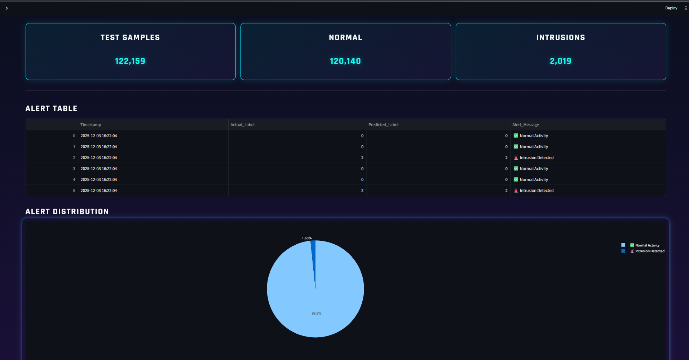

# 🛡️ SentinelNet — AI-Powered Network Intrusion Detection System  
### Real-Time Threat Monitoring • Machine Learning Models • Interactive Dashboard • Cyberpunk UI

  
  
  
  

---

## 🚀 Overview

**SentinelNet** is an advanced **Network Intrusion Detection System (NIDS)** designed to detect malicious network behavior using **Machine Learning** and **Anomaly Detection** techniques.

It analyzes real-time network traffic, predicts threat categories, visualizes metrics, and displays alerts through a futuristic **cyberpunk-themed UI** built in Streamlit.

This system demonstrates a complete end-to-end ML pipeline:

- 📥 Data ingestion  
- 🧹 Cleaning & preprocessing  
- 🤖 Model training (RF, SVM, LR)  
- 🧪 Anomaly detection  
- 📊 Real-time dashboard visualization  
- 🚨 Threat alerting  

---

# 🎥 **Dashboard Demonstration Video**

> The entire UI, animations, ML pipeline integration, and real-time monitoring are shown in the video below.

<video controls width="100%">
  <source src="video/DashboardDemo.mp4" type="video/mp4">
  Your browser does not support the video tag.
</video>

---

# 🖼️ **Screenshots**

### 🔹 **Dashboard Overview**

### 🔹 **Detection Model - Live Analysis**

### 🔹 **Overview Page**

### 🔹 **EDA & Cleaning Page**

### 🔹 **Supervised Models**

### 🔹 **Anomaly Detection (PCA, K-Means, Isolation Forest)**

### 🔹 **Live Alerts Page**

---

# ✨ **Features of SentinelNet**

## 🔍 **1. Real-Time Traffic Analysis**
- Accepts uploaded CSV or live data stream  
- Cleans & preprocesses data automatically  
- Aligns features to match ML model structure  

## 🚨 **2. Attack Classification**
Predicts:
- **Normal**
- **Suspicious**

Uses Random Forest as the primary detection model.

## 📊 **3. Interactive Visual Analytics**
Includes:
- Pie charts  
- Dynamic line charts  
- Confusion matrix  
- Feature importance  
- PCA scatter plots  
- Correlation heatmaps  

## 🤖 **4. Machine Learning Models Used**
| Model | Purpose |
|-------|---------|
| Random Forest | Best accuracy (≈96%) |
| SVM | Secondary classifier |
| Logistic Regression | Comparison model |
| PCA | Dimensionality reduction |
| K-Means | Unsupervised anomaly detection |
| Isolation Forest | Outlier detection |

## 🕹️ **5. Futuristic Streamlit UI**
- Cyberpunk glow theme  
- Hologram slideshow  
- Animated stats cards  
- Sidebar navigation  
- Live monitoring controls  

---

# ⚙️ **Tech Stack**

### ✔ Machine Learning  
- Python, Pandas, NumPy  
- Scikit-Learn  
- PCA, Isolation Forest, K-Means  

### ✔ Dashboard / UI  
- Streamlit  
- Plotly  
- Custom CSS (glow effects + animations)

### ✔ Dataset  
- **CICIDS 2017 – Wednesday Working Hours Dataset**  
Why Wednesday?  
- Balanced normal + DoS traffic  
- Less corrupted data  
- Ideal for training + evaluation  

---

# 🧪 **How the System Works**

## **1️⃣ Data Processing**
- Reads CSV  
- Handles missing values  
- Removes skewed features  
- Applies PCA (optional)  

## **2️⃣ Model Prediction**
- Random Forest predicts traffic category  
- Predictions appended to dataframe  
- Alerts generated instantly  

## **3️⃣ Visualization**
- Updated charts displayed in real time  
- Alerts logged  
- System performance monitored  

---

# ⭐ Final Note

This repository contains:

- Full Streamlit dashboard  
- Machine learning models  
- Real-time analytics  
- A complete demonstration video  
- Clean and professional documentation  
